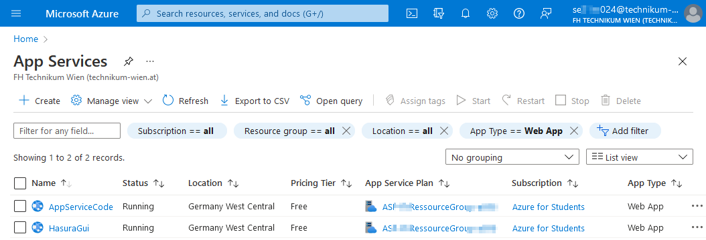
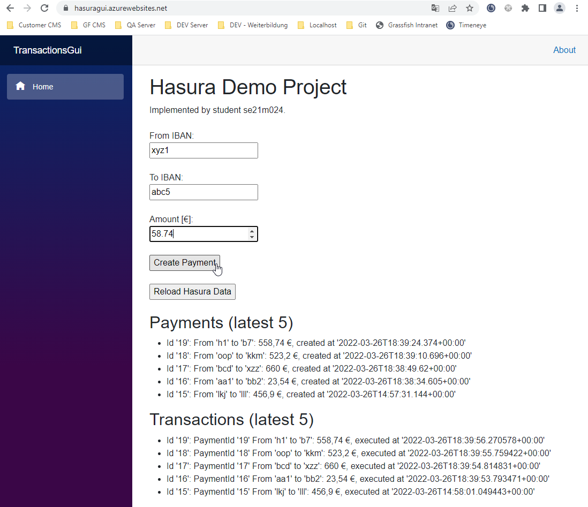
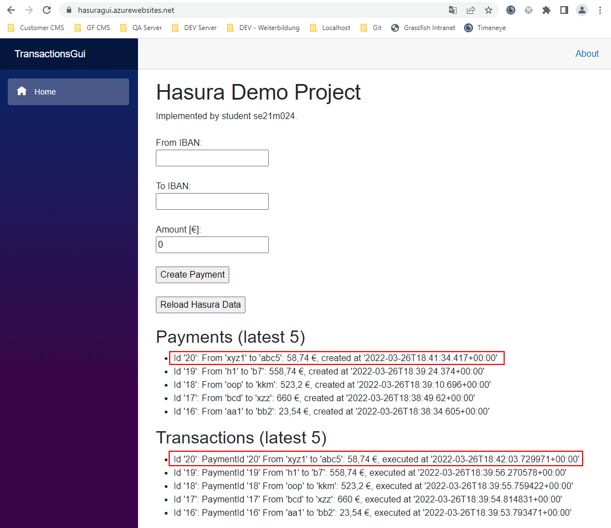
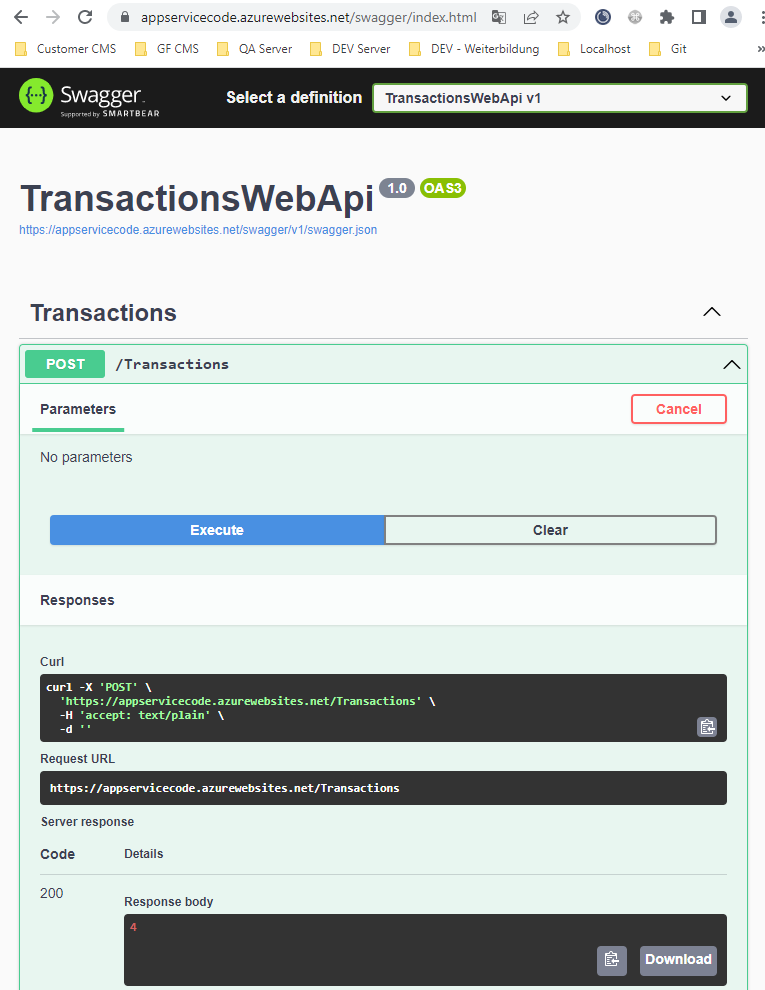
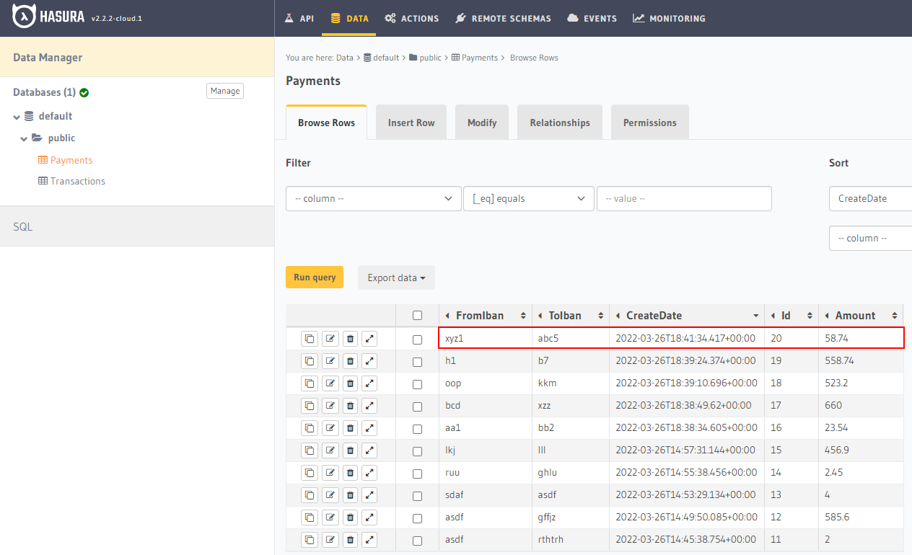
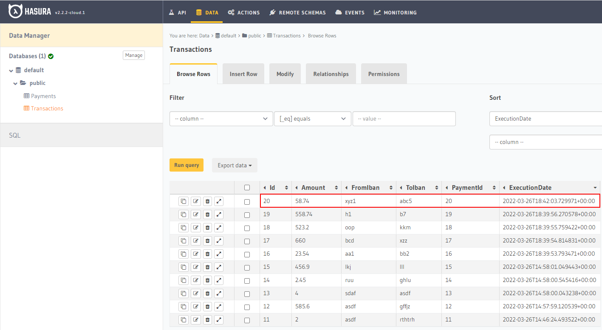
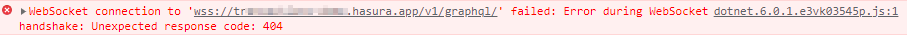
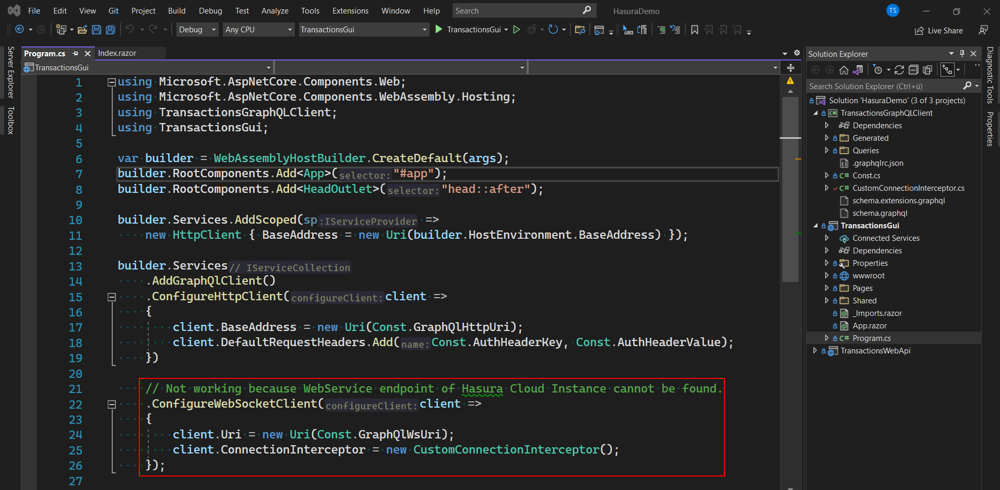
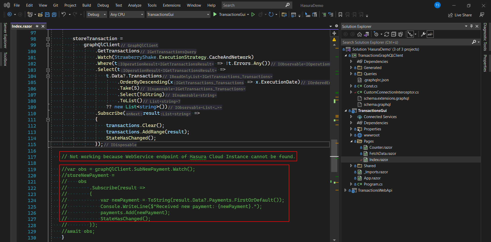
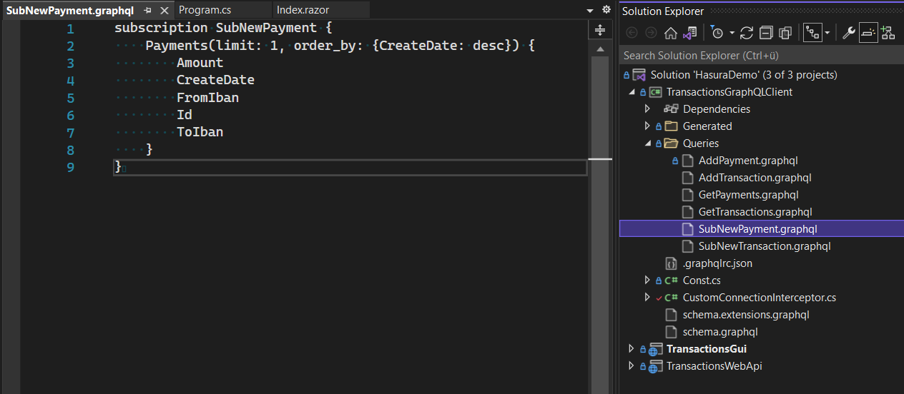

## Software Frameworks

## Assignment: Reactive Systems

## Author: se21m024

 

# Summary

This is a Hasura GraphQL demo project. 

# Repository

Please clone the following repository:
 
https://github.com/se21m024/ReactiveSystemsHasuraDemo
  

# Hosting

The Web GUI for the user and the Web API for the Transactions Service are both hosted as App Services in Azure.

  
They are available at:

- Web GUI: https://hasuragui.azurewebsites.net/
- Web API: https://appservicecode.azurewebsites.net/swagger/index.html

The data is persited in an Heroku database and accessible via the GraphQL enpoint https://transactions-demo.hasura.app/v1/graphql/.  

# Technology

The Web GUI was implemented as .NET 6 Blazor project.
The Web API was implemented as .NET 6 Web Api project.
Both reference a common project '' that capsulates the functionality provided by the GraphQL .NET library Strawberry Shake (https://chillicream.com/docs/strawberryshake).  

# Web GUI (User interface)

Via the user interface, new payments can be created via GraphQL mutations.

The 5 newest payments and transactions can be seen in the bottom of the page. The newly created payment is instantly visible. The new transaction is only visible after it has been created via the Web API (see next chapter) and the 'Reload Hasura Data' button has been clicked (see chapter 'Restrictions').

  

# Web API (Transactions Service)

By calling POST https://appservicecode.azurewebsites.net/Transactions, transactions are created for all open payments via GraphQL mutations. A payment is open as long as no corresponding transaction was created. The web service method returns the number of transactions that were created.

# Persistence

## Payments Table

## Transactions Table

  

# Restrictions

It was planed that the Web API as well as the Web GUI stream changes of the payment and transactions data via GraphQL subscriptions. The necessary code to achive this was implemented but unfortunately I was not able to connect to the websocket of the Hasura Cloud instance. I experienced a 404 NotFound error when trying to connect to the websocket. Even after long investigation and various different approaches I could not manage to resolve this issue. Because of this the two apps poll changes of the data via GraphQL queries.  

  

WebSocket Client Registration

  

Subscription Code

  

GraphQL Subscription

